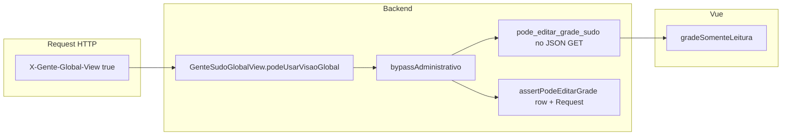

# Plano Fase 1.5 — Bypass administrativo auditado na grade (Kanban)

## Diagnóstico resumido (estado atual)

- **Trava de grade (backend):** [`EscalaWorkflowService::assertPodeEditarGrade`](gente/app/Domain/Escala/EscalaWorkflowService.php) só consulta `normalizarStatusLeitura` + [`EscalaWorkflowStatus::permiteEdicaoGrade`](gente/app/Domain/Escala/EscalaWorkflowStatus.php). **Não** recebe `Request` e **não** chama [`bypassAdministrativo`](gente/app/Domain/Escala/EscalaWorkflowService.php) / [`GenteSudoGlobalView::podeUsarVisaoGlobal`](gente/app/Support/GenteSudoGlobalView.php).
- **Trava visual (frontend):** [`gradeSomenteLeitura`](gente/resources/gente-v3/src/views/escala/EscalaTrabalhoView.vue) = `macroCarregarTudo` **OU** (`status` não é `RASCUNHO`/`DEVOLVIDA_AJUSTE`). **Não** usa Sudo nem `permissoes`.
- **GET workflow:** [`escala_trabalho.php`](gente/routes/escala_trabalho.php) só preenche `workflow` quando existe `setor_id`; em visão macro (`carregar_tudo` sem setor) `workflow` fica `null` — o primeiro ramo do computed tranca sempre.
- **Auditoria de células:** o JSON em `AUDIT_LOG` (bloco ~L699+) **não** inclui flag de intervenção por status; a coluna de ação permanece `ESCALA_ITEM_UPSERT` / `ESCALA_ITEM_DELETE`.

## Ponte Sudo ↔ trava (desenho)

Regra única de negócio (alinhada ao existente): **`pode_editar_grade_sudo === true`** sse `GenteSudoGlobalView::podeUsarVisaoGlobal($user, $request)` (cabeçalho + Gate `bypass-tenant` + whitelist/config já encapsulados aí). Não duplicar lógica de header em outro sítio.

---

## 1. Backend — `EscalaWorkflowService`

**1.1 `assertPodeEditarGrade`**

- Alterar assinatura para aceitar `?Request $request = null` (ou obrigatório nas rotas que já têm `$request`).
- Ordem de decisão:
  1. Se `EscalaWorkflowStatus::permiteEdicaoGrade($st)` → retorna (comportamento atual).
  2. Senão, se `$request` não é `null` e `self::bypassAdministrativo(Auth::user(), $request)` → retorna (intervenção permitida).
  3. Caso contrário → `RuntimeException` com a mesma mensagem orientativa de hoje.
- **Chamadas:** atualizar as duas em [`escala_trabalho.php`](gente/routes/escala_trabalho.php) (POST grade e `copiar-mes-anterior`) para passar `$request`.
- **Testes:** ajustar [`tests/Unit/EscalaWorkflowServiceTest.php`](gente/tests/Unit/EscalaWorkflowServiceTest.php): cenários com `$request === null` (deve manter bloqueio em `EM_VAL_SUPER`); para bypass real seria ideal um teste de integração mínimo com `Request::create` + `Gate::before` / usuário fake — se pesado, documentar teste manual em doc.

**1.2 `montarPayloadApi` (e cabeçalho sintético na visão macro)**

- Incluir **`pode_editar_grade_sudo`** em **todos** os ramos (cabeçalho existente, cabeçalho sintético sem `ESCALA`, e com `ESCALA`): valor = `self::bypassAdministrativo($user, $request)` (já exige header + permissão).
- Garantir que o **GET** devolva um objeto `workflow` **também** quando `carregar_tudo=1` e **não** há `setor_id`: por exemplo um payload mínimo (`escala_id: null`, `status: null`, `status_label`, `permissoes` falsas, **`pode_editar_grade_sudo`** preenchido) montado por um método dedicado (`montarPayloadWorkflowMacro` ou extensão de `montarPayloadApi` com `$cab === null` e `$setorId === 0` com semântica clara) em [`escala_trabalho.php`](gente/routes/escala_trabalho.php) nos ramos que hoje retornam `workflow: null` (sucesso principal, hint inicial, erros 403 se fizer sentido expor a flag só quando autenticado).

**1.3 Constante e auditoria de intervenção na grade**

- Definir constante de ação (nome alinhado ao pedido), por exemplo em [`EscalaWorkflowService`](gente/app/Domain/Escala/EscalaWorkflowService.php) ou [`GenteSudoGlobalView`](gente/app/Support/GenteSudoGlobalView.php): `ACAO_INTERVENCAO_TECNICA_GRADE` (ou `ESCALA_INTERVENCAO_SUDO_GRADE`) — **um identificador estável** para relatórios e grep.
- No POST [`/escala-trabalho`](gente/routes/escala_trabalho.php), **após** carregar `$escalaCab` e **antes** de mutar itens, calcular:
  - `$statusEscala = normalizado...`
  - `$gradeEditBypass = ! EscalaWorkflowStatus::permiteEdicaoGrade($statusEscala) && EscalaWorkflowService::bypassAdministrativo(user, $request)`
- No bloco `AUDIT_LOG`:
  - Enriquecer `ctxJson` com: `intervencao_sudo_grade: true`, `esala_status_no_evento`, `competencia`, `setor_id` (e opcionalmente `motivo` futuro).
  - Se `gradeEditBypass`: na coluna de **ação** (`ACAO`/`acao`), gravar a **constante de intervenção** em vez de `ESCALA_ITEM_UPSERT` / `ESCALA_ITEM_DELETE` **ou** manter o tipo de operação upsert/delete num campo extra no JSON e usar a constante numa coluna `EVENTO`/`evento` se existir (o código já faz `pickCol` para `evento` em alguns caminhos — reutilizar o mesmo padrão). **Recomendação:** manter no JSON o detalhe técnico (`operacao: upsert|delete`) e usar **ACAO** = constante de intervenção quando bypass, para destacar em dashboards; documentar a decisão em [`docs/WORKFLOW_ESCALA_V3_TESTES.md`](gente/docs/WORKFLOW_ESCALA_V3_TESTES.md) ou [`BUSINESS_RULES.md`](gente/docs/BUSINESS_RULES.md) (secção curta).

**1.4 Datas passadas (compliance)**

- O bloqueio `dataEscala < hoje` em [`escala_trabalho.php`](gente/routes/escala_trabalho.php) (~L458) **permanece** na Fase 1.5 (sem relaxar Sudo retroativo sem desenho de motivo obrigatório). Isto evita “furo” de integridade e cumpre o risco citado.
- Registar explicitamente no plano de entrega / doc: **bypass Sudo aplica-se à trava de workflow de cabeçalho (`ESCALA_STATUS`) e à visão macro no Vue**, não ao bloqueio temporal, até haver fluxo auditado de motivo (backlog).

**1.5 Estados órfãos**

- Manter [`normalizarStatusLeitura`](gente/app/Domain/Escala/EscalaWorkflowService.php) como fonte única; qualquer string não mapeada continua a ser comparada por `permiteEdicaoGrade` (falso → só entra com Sudo). Não é necessária nova migration salvo descoberta de valores inconsistentes em produção.

---

## 2. Frontend — [`EscalaTrabalhoView.vue`](gente/resources/gente-v3/src/views/escala/EscalaTrabalhoView.vue)

**2.1 `gradeSomenteLeitura`**

- Definir `const sudoUnlock = !!workflow.value?.pode_editar_grade_sudo`.
- Nova lógica:
  - `statusBloqueado = workflow.value && String(workflow.value.status || '') !== WF_STATUS_RASCUNHO && !== WF_STATUS_DEVOLVIDA` (tratar `status` null na macro como “não bloqueado por status” quando só interessa macro).
  - `macroBloqueado = macroCarregarTudo.value` (mas **anulado** se `sudoUnlock`).
  - `gradeSomenteLeitura = (macroBloqueado || statusBloqueado) && !sudoUnlock`.
- Garantir que `fetchEscala` atribua `workflow` mesmo no ramo macro (passa a receber objeto mínimo do backend).

**2.2 Indicador visual (Sudo a destrancar)**

- Quando `sudoUnlock && gradeSomenteLeitura` seria `false` mas **ainda** haveria “destrancamento ativo” por status ou macro: mostrar faixa compacta acima da grade (ex.: “Intervenção administrativa ativa — edições auditadas”) **ou** classe `grade-sudo-unlock` na `grade-card` / `turnos-bar` com borda dourada + ícone (raio / cadeado).
- Não é obrigatório marcar **cada célula** (ruído); cabeçalho da área Kanban + barra de turnos é suficiente para operação; se quiserem célula-a-célula, segundo incremento.

**2.3 Visão macro + performance**

- Com `sudoUnlock`, permitir edição na macro; opcional: `confirm()` único na primeira ação de drop na sessão (“Visão macro pode ser lenta”) — mitigação leve de UX.

---

## 3. Ficheiros a alterar (lista fechada)

| Ficheiro | Alteração |
|----------|-----------|
| [`gente/app/Domain/Escala/EscalaWorkflowService.php`](gente/app/Domain/Escala/EscalaWorkflowService.php) | `assertPodeEditarGrade(..., ?Request)` + bypass; `montarPayloadApi` + helper macro; constante de auditoria (ou referência cruzada a `GenteSudoGlobalView`). |
| [`gente/routes/escala_trabalho.php`](gente/routes/escala_trabalho.php) | Passar `$request` ao assert; GET com `workflow` mínimo em macro; cálculo `gradeEditBypass` e enriquecimento do audit no POST. |
| [`gente/resources/gente-v3/src/views/escala/EscalaTrabalhoView.vue`](gente/resources/gente-v3/src/views/escala/EscalaTrabalhoView.vue) | Computed `gradeSomenteLeitura`; estilos/indicador Sudo; possível confirmação macro. |
| [`gente/tests/Unit/EscalaWorkflowServiceTest.php`](gente/tests/Unit/EscalaWorkflowServiceTest.php) | Assinatura nova + teste null request. |
| [`gente/docs/WORKFLOW_ESCALA_V3_TESTES.md`](gente/docs/WORKFLOW_ESCALA_V3_TESTES.md) ou [`gente/docs/BUSINESS_RULES.md`](gente/docs/BUSINESS_RULES.md) | Regras: o que Sudo destranca / o que não; formato do log de intervenção. |

---

## 4. Riscos e mitigação (explicitamente)

| Risco | Mitigação |
|-------|-----------|
| Sudo “abre” UI mas POST ainda falha | Mesma função `bypassAdministrativo` no assert e no JSON; testar POST com header em escala `HOMOLOG_SAGEP`. |
| Falso positivo com header spoof | Já mitigado: `Gate::bypass-tenant` + cabeçalho (Zero Trust existente). |
| Auditoria fraca | ACao/JSON distintos quando `gradeEditBypass`; IP/UA já gravados. |
| Retroativo sem regra | Fora do escopo 1.5; bloqueio de data mantido. |

---

## 5. Ordem de implementação sugerida

1. Service (`assert` + `montarPayload` + constante).
2. Rota GET (workflow macro) + POST (assert + audit).
3. Vue (computed + UI + fetch).
4. Testes + documentação.
